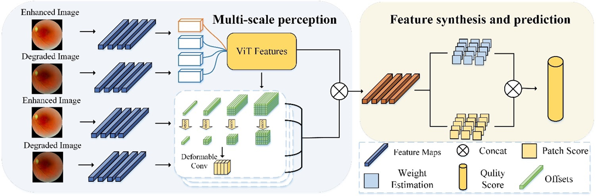

# Enhanced Fundus Image Quality Assessment using Spatial Deformable Multi-Scale Perception Network
> **Abstract:** Fundus images play a crucial role in diagnosing and monitoring eye diseases. However, their quality is often compromised during acquisition, necessitating effective enhancement algorithms. Evaluating the quality of enhanced fundus images remains challenging. In this study, we propose a Spatial Deformable Multi-Scale Perception Network (SDMP-Net) specifically designed for Full-Reference Fundus Image Quality Assessment (FR-FIQA). By integrating Convolutional Neural Networks (CNNs) and Vision Transformers (ViTs), SDMP-Net extracts both local and global features adaptively, capturing fine textures and structural details. We construct an Enhanced Fundus Image Dataset (EFID) comprising 300 degraded fundus images enhanced by six different algorithms, totaling 1800 images. Extensive experiments on EFID demonstrate that SDMP-Net achieves a Spearman rank-order correlation coefficient of 0.807 and a Pearson linear correlation coefficient of 0.803, outperforming state-of-the-art methods. Our work contributes to enhancing the reliability of fundus image enhancement and facilitating clinical diagnostics. 
## Architecture

  

## Requirements

To run the code, you need the following dependencies:
- Linux
- Python 3.9
- pytorch==1.12.1
- timm 
- torchvision
- tqdm
- scipy
- numpy
  
You can install the dependencies with:
[pip install -r guideline.txt](URL "title")

## Dataset
The Enhanced Fundus Image Dataset (EFID) can be downloaded from [(https://pan.quark.cn/s/47b0a78776f4)](URL "title"). 
The enhanced images are in the ./enhanced folder. The Label_train.txt and Label_test.txt files contain the quality labels for the training and testing images, respectively.

### Dataset Structure
data/
  - train_ref/                 >>> Directory with reference images
- train_eha/                  >>> Directory with enhanced images
 - Label_train_list.txt         >>> Image quality labels for the training images
 - val_ref/                     >>> Directory with reference images for validation
 - val_eha/                     >>> Directory with enhanced images for validation
 - Label_val_list.txt           >>> Image quality labels for the validation image 
  
### Training the Model
To train the SDMP-Net model, modify the configuration options in train_options.py as needed and run the following command:
python train.py
- train_ref_path data/train_ref
- train_eha_path data/train_eha
- train_list data/train_list.txt 
- val_ref_path data/val_ref 
- val_eha_path data/val_eha 
- val_list data/val_list.txt
    
## Configuration Options
Modify the following key parameters in train_options.py:
- learning_rate: Initial learning rate for the optimizer
- batch_size: Number of images per batch during training
- n_epoch: Total number of training epochs
- T_max: Maximum number of iterations for the cosine annealing learning rate scheduler
- num_workers: Number of data loading workers
  
## Checkpoints
During training, model checkpoints will be saved to the directory specified in the configuration file [checkpoints_dir](URL "title"). You can resume training from a specific epoch using the [--load_epoch](URL "title") option.

## Contact
If you have any questions, please email 1779624166@qq.com
